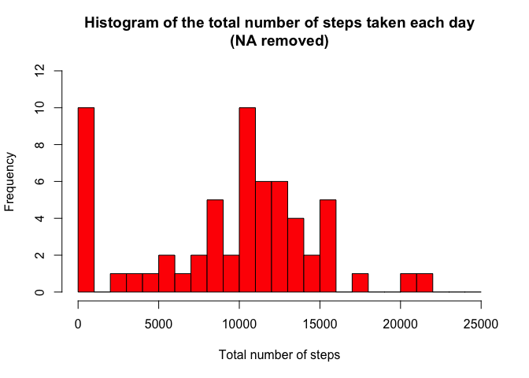
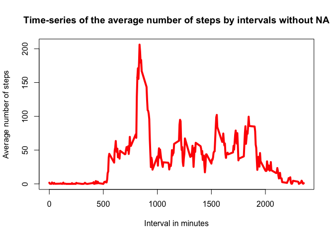
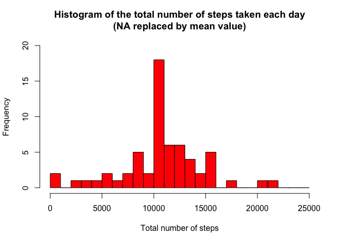
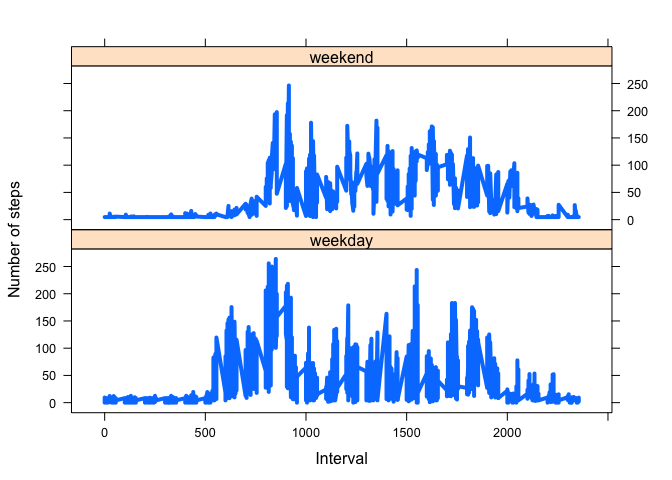

# Reproducible Research: Peer Assessment 1

```r
require(graphics)
require(ggplot2)
```

```
## Loading required package: ggplot2
```

```r
require(lattice)
```

```
## Loading required package: lattice
```

## Loading and preprocessing the data
Show any code that is needed to

1. Load the data (i.e. 𝚛𝚎𝚊𝚍.𝚌𝚜𝚟())

```r
Activity_temp<-read.csv("activity.csv")
```
2. Process/transform the data (if necessary) into a format suitable for your analysis

```r
Activity_temp$date<-as.Date(Activity_temp$date,format="%Y-%m-%d")
# Check day of the week and add to the Activity_tmp file
Activity_temp <- data.frame(date=Activity_temp$date, 
                           weekday=tolower(weekdays(Activity_temp$date)), 
                           steps=Activity_temp$steps, 
                           interval=Activity_temp$interval)

# Create a new column with information about if its week day or weekend day.
daytype=ifelse(Activity_temp$weekday == "saturday" | Activity_temp$weekday == "sunday", "weekend", "weekday")

# Generate the dataset I will use along the assignment.
Activity <- data.frame(date=Activity_temp$date, 
                       weekday=Activity_temp$weekday, 
                       daytype=daytype, 
                       steps=Activity_temp$steps,
                       interval=Activity_temp$interval)

#Remove temporal dataframes
rm(Activity_temp)
rm(daytype)
```
## What is mean total number of steps taken per day?
For this part of the assignment, you can ignore the missing values in the dataset.

1. Calculate the total number of steps taken per day

```r
# Generate a new dataframe with the unique dates and add the steps for each day.
Activity_day<-data.frame(unique(Activity$date))
Steps<-tapply(Activity$steps, Activity$date, sum, na.rm=TRUE)
Activity_day$Steps<-as.numeric(Steps)
colnames(Activity_day)<-c("Date","Total_Steps")

#Remove temporal dataframes
rm(Steps)
```
2. Make a histogram of the total number of steps taken each day

```r
hist(Activity_day$Total_Steps, 
     breaks=seq(from=0, to=25000, by=1000),
     col="red", 
     xlab="Total number of steps", 
     ylim=c(0, 12), 
     main="Histogram of the total number of steps taken each day\n(NA removed)")
```



3. Calculate and report the mean and median of the total number of steps taken per day

```r
mean<-mean(Activity_day$Total_Steps)
median<-median(Activity_day$Total_Steps)
```

The value of the mean is: 

```r
mean
```

```
## [1] 9354.23
```
The value of the median is:

```r
median
```

```
## [1] 10395
```

## What is the average daily activity pattern?

1. Make a time series plot (i.e. 𝚝𝚢𝚙𝚎 = "𝚕") of the 5-minute interval (x-axis) and the average number of steps taken, averaged across all days (y-axis)

```r
# Compute the means of steps accross all days for each interval
Average1 <- aggregate(Activity$steps, 
                       by=list(Activity$interval), 
                       FUN=mean, 
                       na.rm=TRUE)

# Rename the attributes
colnames(Average1) <- c("interval", "mean")

# Compute the time series plot
plot(Average1$interval, 
     Average1$mean, 
     type="l", 
     col="red", 
     lwd=4, 
     xlab="Interval in minutes", 
     ylab="Average number of steps", 
     main="Time-series of the average number of steps by intervals without NA")
```



2. Which 5-minute interval, on average across all the days in the dataset, contains the maximum number of steps?

```r
# Position inside the array of the maximum value
max_pos <- which(Average1$mean == max(Average1$mean))

# Lookup for the interval in this position
max_interval <- Average1[max_pos, 1]
```

The 5-minute interval which contains the maximum number of steps is:

```r
max_interval
```

```
## [1] 835
```
## Imputing missing values
Note that there are a number of days/intervals where there are missing values (coded as 𝙽𝙰). The presence of missing days may introduce bias into some calculations or summaries of the data.

1. Calculate and report the total number of missing values in the dataset (i.e. the total number of rows with 𝙽𝙰s)

```r
NAs<-sum(is.na(Activity$steps))
```
The total number of missing values in the dataset is:

```r
NAs
```

```
## [1] 2304
```
2. Devise a strategy for filling in all of the missing values in the dataset. The strategy does not need to be sophisticated. For example, you could use the mean/median for that day, or the mean for that 5-minute interval, etc.

The strategy will be to complete the NA values with the overall mean.

```r
# Find the position in the array of the NA values
Position_NAs <- which(is.na(Activity$steps))
# Create a vector of means
means<-rep(mean(Activity$steps, na.rm=TRUE), times=length(Position_NAs))
```
3. Create a new dataset that is equal to the original dataset but with the missing data filled in.

In the positions previously obtained, we will insert the mean value.

```r
# Generate the new data
Activity_NONA<-Activity
Activity_NONA$steps[Position_NAs]<-means
```
4. Make a histogram of the total number of steps taken each day and Calculate and report the mean and median total number of steps taken per day. Do these values differ from the estimates from the first part of the assignment? What is the impact of imputing missing data on the estimates of the total daily number of steps?

```r
# Generate a new dataframe with the unique dates and add the steps for each day.
Activity_day_NONA<-data.frame(unique(Activity_NONA$date))
Steps<-tapply(Activity_NONA$steps, Activity_NONA$date, sum, na.rm=TRUE)
Activity_day_NONA$Steps<-as.numeric(Steps)
colnames(Activity_day_NONA)<-c("Date","Total_Steps")

#Remove temporal dataframes
rm(Steps)
```


```r
# Compute the histogram of the total number of steps each day
hist(Activity_day_NONA$Total_Steps, 
     breaks=seq(from=0, to=25000, by=1000),
     col="red", 
     xlab="Total number of steps", 
     ylim=c(0, 20), 
     main="Histogram of the total number of steps taken each day\n(NA replaced by mean value)")
```



As we can see, we have change the distribution of the histogram, increase the pick arround the value of steps of the median value. It looks more a really picked gaussian distribution.


```r
mean2<-mean(Activity_day_NONA$Total_Steps)
median2<-median(Activity_day_NONA$Total_Steps)
```

The value of the mean is: 

```r
mean2
```

```
## [1] 10766.19
```
The value of the median is:

```r
median2
```

```
## [1] 10766.19
```

As we can see, we got same value, this appreciated change in the distribution is shown by the mean and median value as well. 

## Are there differences in activity patterns between weekdays and weekends?
For this part the 𝚠𝚎𝚎𝚔𝚍𝚊𝚢𝚜() function may be of some help here. Use the dataset with the filled-in missing values for this part.

1. Create a new factor variable in the dataset with two levels – “weekday” and “weekend” indicating whether a given date is a weekday or weekend day.

It was created in the preparation step at the beggining.


```r
head(Activity_NONA)
```

```
##         date weekday daytype   steps interval
## 1 2012-10-01  monday weekday 37.3826        0
## 2 2012-10-01  monday weekday 37.3826        5
## 3 2012-10-01  monday weekday 37.3826       10
## 4 2012-10-01  monday weekday 37.3826       15
## 5 2012-10-01  monday weekday 37.3826       20
## 6 2012-10-01  monday weekday 37.3826       25
```

2. Make a panel plot containing a time series plot (i.e. 𝚝𝚢𝚙𝚎 = "𝚕") of the 5-minute interval (x-axis) and the average number of steps taken, averaged across all weekday days or weekend days (y-axis). See the README file in the GitHub repository to see an example of what this plot should look like using simulated data.


```r
# Compute the average number of steps taken, averaged across all daytype variable
Average2 <- aggregate(Activity_NONA$steps, 
                    by=list(Activity_NONA$daytype, Activity_NONA$weekday, Activity_NONA$interval), mean)

#Rename the attributes
colnames(Average2) <- c("daytype", "weekday", "interval", "mean")
```

And finally the panel plot:


```r
# Compute the time serie plot
xyplot(mean ~ interval | daytype, Average2, 
       type="l", 
       lwd=4, 
       xlab="Interval", 
       ylab="Number of steps", 
       layout=c(1,2))
```


